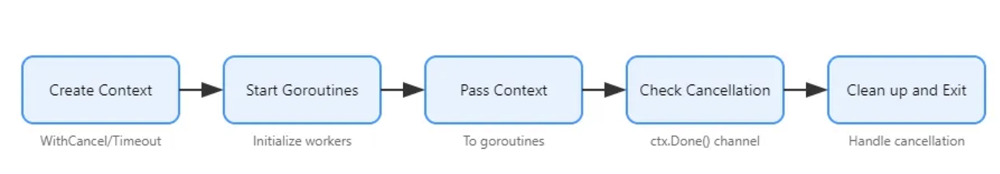
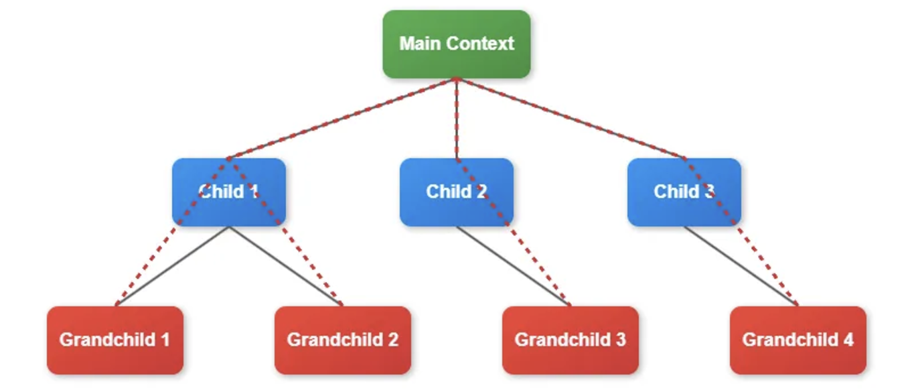

`context` package provides a standardized way to carry deadlines, cancellation signals, and other request-scoped values across api boundaries and between processes

one of the most powerful features of the `context` package is its ability to propagate cancellation signals down a call graph

particularly useful for cleaning up resources, stopping long-running operations, or handling timeouts in concurrent programs

great at:
- implementing timeouts for http requests
- cancelling long-running database queries
- managing resource cleanup in concurrent operations
- propagating cancellation signals across multiple goroutines

one of the key advantages of using the `context` package is that it provides a standard way to handle cancellation across different go libraries and apis

keep in mind:
overuse of contexts can make code harder to understand and maintain
it's generally a good practice to pass contexts explicitly rather than storing them in structs, and to use them primarily for cancellation and deadlines rather than for passing optional parameters
