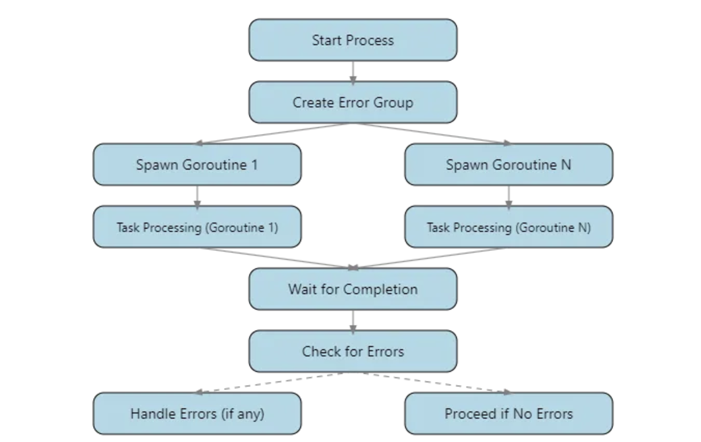

this pattern provided by the `golang.org/x/sync/errgroup` package, is an excellent tool for managing a group of goroutines and collecting their errors

particularly useful when you need to run multiple operations concurrently and want to handle their errors in a coordinated way

`errgroup.Group` type provides a way to wait for a collection of goroutines to complete and returns the first non-nil error (if any) from them
this makes it easy to manage concurrent operations that can fail independently while still providing a clear and manageable error handling strategy

great at:
- concurrent api calls where you need to aggregate results or handle errors
- parallel file operations where you want to stop processing if any file operation fails
- coordinated shutdown of multiple services or goroutines

it’s worth noting that the error group pattern cancels all operations if any of them return an error
this can be beneficial in many cases, as it allows you to implement a fail-fast behavior

if you need more fine-grained control over error handling or if you want to continue processing even if some operations fail, you might need to implement a custom solution 