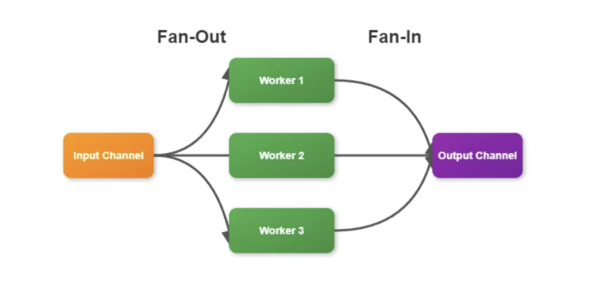

when you need to split a task into multiple sub-tasks and then combine the results, the fan-out fan-in pattern is your go-to solution

particularly useful for parallel processing of data or when you need to distribute work across multiple goroutines and then aggregate the results

fan-out part: involves distributing the work to multiple goroutines or functions that can run concurrently
fan-in part: involves collecting the results from all these concurrent operations and combining them into a single stream

great at scenarios like parallel data processing or distributed computing tasks:
- use it to process large datasets by splitting them into chunks, processing each chunk concurrently, and then aggregating the results
- scenarios where you need to make multiple api calls in parallel and combine their responses

keep in mind:
it’s important to consider the overhead of creating and managing multiple goroutines and channels
in some cases, if the processing of each item is very quick, the overhead might outweigh the benefits of parallelism