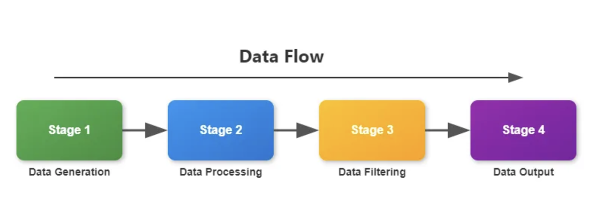

excellent for creating a series of processing stages, where each stage performs a specific operation on the data

very useful when you have a sequence of operations that need to be applied to a stream of data and you want to process these operations concurrently

the beauty of this pattern is that each stage runs in its own goroutine, allowing for concurrent processing

this pattern can lead to improved throughput, especially when dealing with I/O-bound operations or when processing a large stream of data

great at:
- etl jobs
- image or video processing
- text processing and analysis
- financial data analysis

pros:
- each stage is independent and can be developed, tested, and maintained separately
cons:
- overall performance of the pipeline is limited by its slowest stage