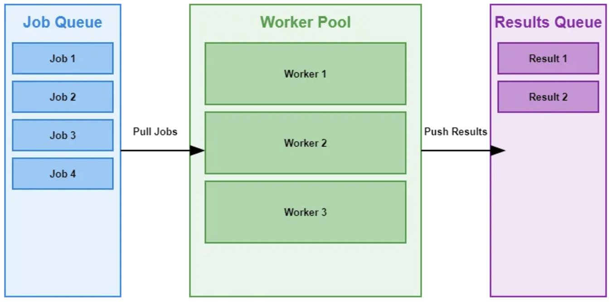

allows you to process a large number of jobs concurrently, making the most of your system’s resources

core idea is to create a fixed number of worker goroutines that continuously pull jobs from a shared channel

this approach helps limit the number of concurrently running goroutines, preventing resource exhaustion while still allowing for parallel processing

great at:
- batch processing
- handling multiple api requests simultaneously
- load balancing, as tasks are distributed evenly among the available workers

Real world example:
```Go
// This script migrates tickets from Polarion to Jira
// It reads a csv file with the realtions between tickets and create a worker pool of 100
package main

import (
	"encoding/csv"
	"fmt"
	"log"
	"os"
	"os/exec"
)

type JobFields struct {
	wiProject string
	wiID      string
	jiraID    string
}

type JobResult struct {
	job JobFields
	err error
}

func workerPool(numWorkers int, jobs <-chan JobFields, results chan<- JobResult) {
	for i := 0; i < numWorkers; i++ {
		go worker(jobs, results)
	}
}

func worker(jobs <-chan JobFields, results chan<- JobResult) {
	for j := range jobs {
		results <- process(j)
	}
}

func process(job JobFields) JobResult {
	cmd := exec.Command("python", "migrator.py", job.wiProject, job.wiID, job.jiraID)
	err := cmd.Run()
	return JobResult{
		job: job,
		err: err,
	}
}

func main() {
	filename := "tickets.csv"

	file, err := os.Open(filename)
	if err != nil {
		log.Fatal("Error opening file:", err)
	}
	defer file.Close()

	reader := csv.NewReader(file)
	reader.Comma = ','
	reader.LazyQuotes = true

	records, err := reader.ReadAll()
	if err != nil {
		log.Fatal("Error reading headers:", err)
	}

	var jobList []JobFields
	for i, row := range records {
		if i == 0 {
			continue
		}

		jobList = append(jobList, JobFields{
			wiProject: "C48",
			wiID:      row[3],
			jiraID:    row[0],
		})
	}

	numJobs := len(jobList)
	fmt.Printf("Number of tickets to migrate: %d\n", numJobs)

	jobs := make(chan JobFields, numJobs)
	results := make(chan JobResult, numJobs)

	workerPool(100, jobs, results)

	for _, job := range jobList {
		jobs <- job
	}
	close(jobs)

	for i := 0; i < numJobs; i++ {
		result := <-results
		if result.err != nil {
			fmt.Printf("Job failed for Polarion ID: %s -> Jira ID: %s\n", result.job.wiID, result.job.jiraID)
		} else {
			fmt.Printf("Job succeeded for Polarion ID: %s -> Jira ID: %s\n", result.job.wiID, result.job.jiraID)
		}
	}
	fmt.Println("Done...")
}
```
